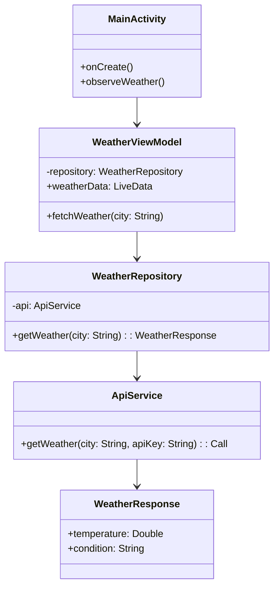
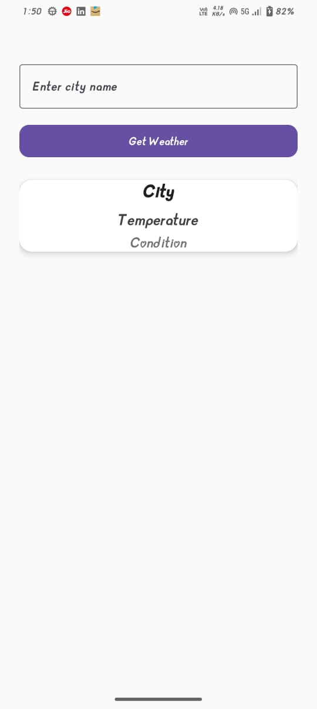
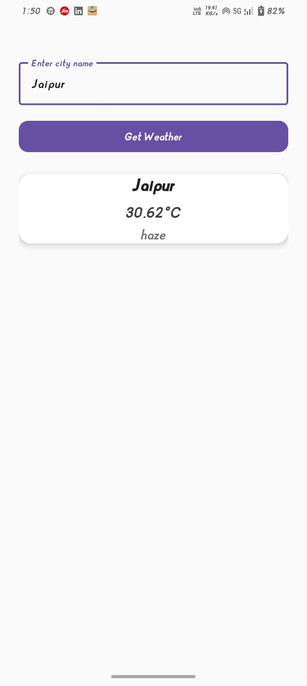

# 🌦️ Weather App (Current City)

An Android app that fetches real-time weather data for the user’s current city using a free Weather API. Built with MVVM architecture, Retrofit, and LiveData.

# ✨ Features

🌍 Detect current city (via API call).

🌡️ Show temperature & condition (e.g., "25°C, Clear").

🔄 Updates UI reactively with ViewModel + LiveData.

🚀 Clean MVVM architecture with a repository layer.

# 🗂️ Project Structure

com.example.weatherapp

│

├── api/

│   ├── ApiService.kt         # Retrofit interface for API calls

│

├── data/

│   ├── WeatherResponse.kt    # Data class for API response (JSON → Kotlin)

│   ├── WeatherRepository.kt  # Repository layer to fetch weather

│

├── ui/

│   ├── WeatherViewModel.kt   # Holds weather data for UI

│   ├── MainActivity.kt       # Displays weather info

│

└── utils/

    └── Resource.kt           # (Optional) Wrapper for success/error/loading

# 📊 Class Diagram

# 🔑 Key Components

ApiService.kt → Defines Retrofit API endpoints.

WeatherResponse.kt → Maps JSON response to Kotlin data class.

WeatherRepository.kt → Abstracts API calls, provides data to ViewModel.

WeatherViewModel.kt → Stores LiveData for weather data, survives config changes.

MainActivity.kt → Observes ViewModel & updates UI.

# 🛠️ Tech Stack

Kotlin

MVVM (Model-View-ViewModel)

Retrofit2 + Gson

LiveData + ViewModel (AndroidX Lifecycle)

# 🚀 How It Works

MainActivity asks WeatherViewModel for weather.

WeatherViewModel delegates call to WeatherRepository.

WeatherRepository calls API via ApiService (Retrofit).

API response mapped into WeatherResponse data class.

LiveData in WeatherViewModel updates → UI automatically refreshes.

# 🖼️ Sample UI

### INPUT

### OUTPUT

	
# 📌 Key Learning

This app shows how to:

Connect Android with an external REST API.

Use Retrofit cleanly in MVVM.

Observe LiveData in Activity for automatic UI updates.

Structure apps with Repository pattern.
